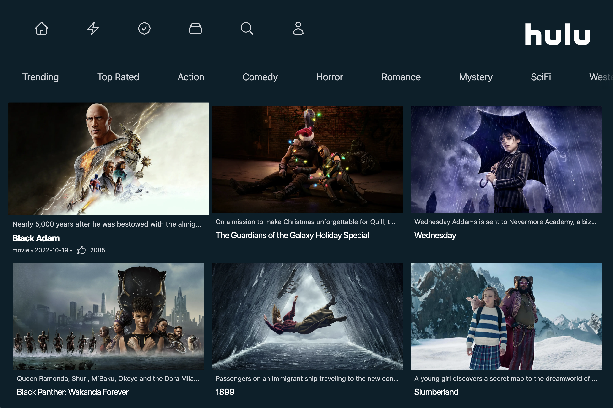

## Hulu clone

> A Next landing page that routes different movie genre from "themoviedb" API.



Featuring:

- A [Next.js](https://nextjs.org/) project bootstrapped with [`create-next-app`](https://nextjs.org/docs/api-reference/create-next-app).
- Tailwindcss support by following the [Install Tailwind CSS with Next.js](https://tailwindcss.com/docs/guides/nextjs) guide.
- We (SSR) a `props` list of movies depending on the current `query` context.

```js
export async function getServerSideProps(context) {
  // We default if no route is selected & pushed via `NavBar.js` query param.
  // We use the `query` data in our fetch to interpolate the needed API call.
  const genre = context.query.genre;
  console.log(context.query);
  const req = await fetch(
    `https://api.themoviedb.org/3${
      /* # https://developer.mozilla.org/en-US/docs/Web/API/Response/json:
      The json() method of the Response interface takes a Response stream and
      reads it to completion. It returns a promise which resolves with a result
      of parsing the body text as JSON. Note that despite the method being named
      json(), the result is not JSON, but instead the result of taking JSON as
      input, and parsing it to produce a JS object. */
      requests[genre]?.url || requests.fetchTrending.url
    }`
  ).then((res) => res.json());
  return {
    props: {
      results: req.results,
    },
  };
}
```

- The component that changes the route is the NavBar via `useRouter`.

```jsx
function NavBar() {
  const router = useRouter();
  return (
    <nav className="relative">
      <div className="flex px-10 space-x-10 overflow-x-scroll text-2xl sm:px-20 whitespace-nowrap sm:space-x-20 scrollbar-hide">
        {Object.entries(requests).map(([key, { title, url }]) => (
          <h1
            key={key}
            onClick={() => router.push(`/?genre=${key}`)}
            className="text-xl transition duration-100 transform cursor-pointer hover:scale-125 hover:text-white active:text-red-500 last:pr-24"
          >
            {title}
          </h1>
        ))}
      </div>
      <div className="absolute top-0 right-0 bg-gradient-to-r from-transparent to-[#06202A] h-10 w-10"></div>
    </nav>
  );
}
```

- Tidy tailwind breakpoints for `sm:`, `md:`, `xl:` and a custom `3xl` layout.

```jsx
function MainContent({ results }) {
  return (
    <div className="flex-wrap justify-center px-5 my-10 sm:grid md:grid-cols-2 xl:grid-cols-3 3xl:flex">
      {results.map((result) => (
        <Thumbnail key={result.id} result={result} />
      ))}
    </div>
  );
}
```

- For more information, see Next.js documentation [getServerSideProps](https://nextjs.org/docs/api-reference/data-fetching/get-server-side-props).

When exporting a function call `getServerSideProps` (Server-Side Rendering) from
a page, Next.js will pre-render this page on each request using a data returned
by `getServerSideProps`. Useful if you want to fetch data that changes often, &
have the page update to show the most current data.

```jsx
export async function getServerSideProps(context) {
  return {
    props: {}, // will be passed to the page component as props
  };
}
```

You can import module in top-level scope for use in `getServerSideProps`. Import
used will not be bundled for the client-side. Meaning, you can write server-side
code directly in `getServerSideProps`, including fetching data from say a db.

- The `context` parameter is an object containing the following keys:

`params`: If this page uses a dynamic route, params contains route parameters.
If the page name is `[id].js` , then params will look like` { id: ... }`.

`query`: An object representing the query string, including dynamic route param.

For more information, see [context parameter](https://nextjs.org/docs/api-reference/data-fetching/get-server-side-props#context-parameter)

- `getServerSideProps` return value:

The `getServerSideProps` function should return an object with any one of the following properties:

The `props` object is a key-value pair, where each value is received by the page
component. It should be a serializable object so that any props passed, could be
serialized with `JSON.stringify`.

```jsx
export async function getServerSideProps(context) {
  return {
    props: { message: `Next.js is awesome` }, // will be passed to the page component as props
  };
}
```

The `notFound` boolean allows the page to return a 404 status and 404 Page. With
notFound set at true, the page will return 404 even if there was a successfully
generated page before. This supports use cases like user-generated content, when
getting removed by its author.

```jsx
export async function getServerSideProps(context) {
  const res = await fetch(`https://.../data`);
  const data = await res.json();

  if (!data) {
    return {
      notFound: true,
    };
  }

  return {
    props: { data }, // will be passed to the page component as props
  };
}
```

Regards, <br />
Luigi Lupini <br />
<br />
I ❤️ all things (🇮🇹 / 🛵 / ☕️ / 👨‍👩‍👧)<br />

This is a [Next.js](https://nextjs.org/) project bootstrapped with [`create-next-app`](https://github.com/vercel/next.js/tree/canary/packages/create-next-app).

## Getting Started

First, run the development server:

```bash
npm run dev
# or
yarn dev
```

Open [http://localhost:3000](http://localhost:3000) with your browser to see the result.

You can start editing the page by modifying `pages/index.js`. The page auto-updates as you edit the file.

[API routes](https://nextjs.org/docs/api-routes/introduction) can be accessed on [http://localhost:3000/api/hello](http://localhost:3000/api/hello). This endpoint can be edited in `pages/api/hello.js`.

The `pages/api` directory is mapped to `/api/*`. Files in this directory are treated as [API routes](https://nextjs.org/docs/api-routes/introduction) instead of React pages.
